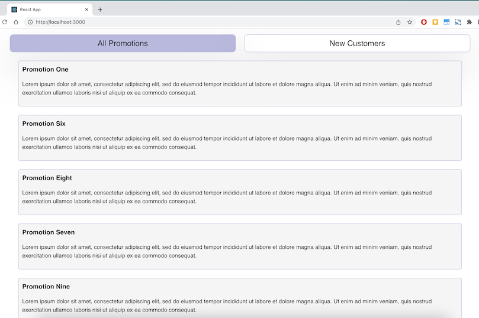
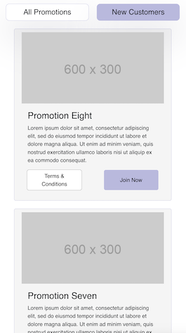

# Getting Started with React Promotions App

Basic ReactJs Web app which shows promotions for new customers and all promotions.

  
  

## Library Used

- Bootstrap

I have choosed to developed UI with bootstrap because it provide pre built CSS styles, components which help us to create responsive web applications quickly and easily. It speed up the development process and ensure a consistent design across the app.

- Axios

I have used Axios library for making API call, as it provides an easy-to-use API including support for Promises and async/await syntax, consistent cross-browser compatibility and it automatically handles JSON data, parsing it into JavaScript objects which makes our frontent work easier.

<b>Drag and Drop reorder functionality</b>

I have choosed to go with HTML 5 core draggable property and events to implement Drag and Drop reorder functionality in "All Promotions" tab. Reason why i have not used any third party package because it may impact the app's performance and load times, increase size, create stability and compatibility issue if it is not well-maintained in future.

## Prerequisites

Before you can run this app, you'll need to make sure that you have the following installed on your system:

- Node.js (version 14 or higher)
- npm or yarn

## Installation

To install the dependencies for this app, run the following command in your terminal:

### `npm install` or `yarn install`

## Usage

To start the development server, run the following command:

### `npm start` or `yarn start`

This will start the app and open it in your default web browser at `http://localhost:3000`.
